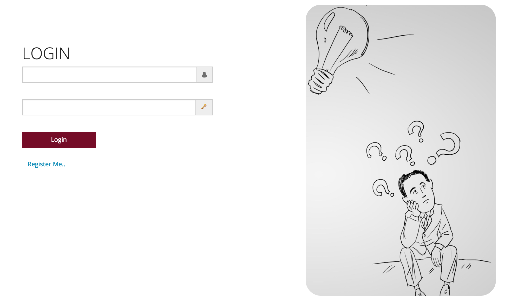
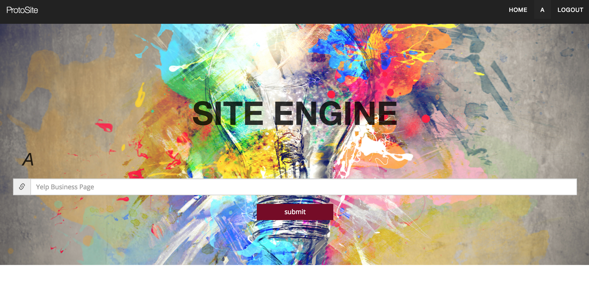
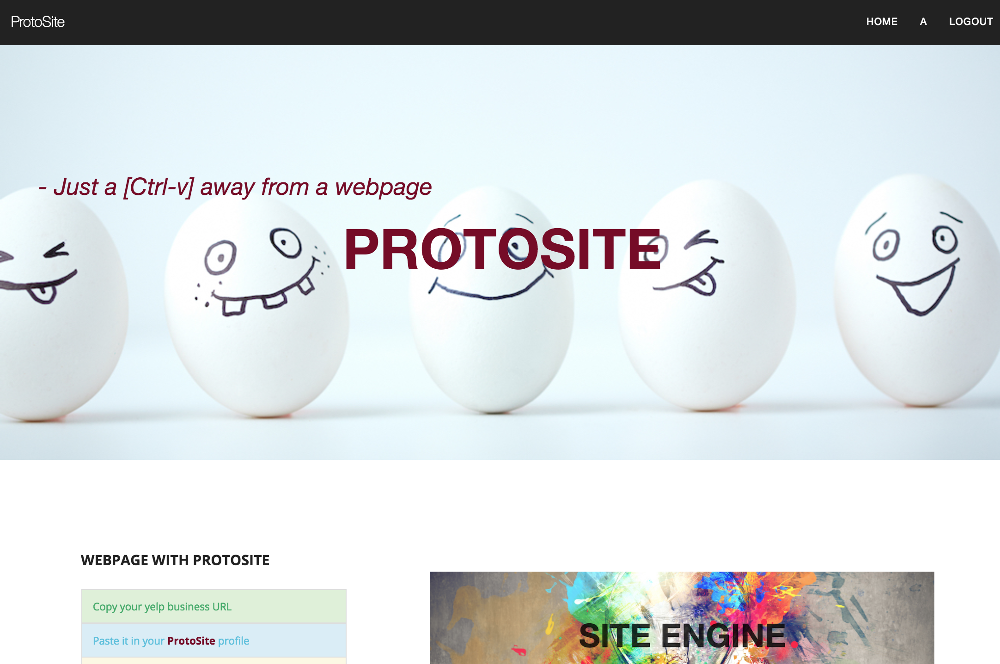

#ProtoSite

###About:
App is build and design to help peoples to create a small business web page in the simpliest way possible.
Simpliest way possible as in, It requires on two commands:
1. Cmd+C
2. Cmd+V

### Wireframe

---

###Technologies Used
* Language: Javascript
* Web-Application Frameworks: Node.js and Express, Underscore.js
* Front-end technologies: Angular.js, Bootstrap, JQuery
* Database: MongoDB
* Deployment: Heroku
* Third-party APIs: Yelp, Google Maps

###User Stories
1. As a user, I can login/logout into/from the system.
2. As a user, I can register and create a profile.
3. As a user, I can build my site and set it up and running in no time.
4. As a user, I can track all the pages I have created.
5. Web pages are assisted with button to navigate over the page.
6. As a user, I can save my web page to share and publish.

## Future Work

1. Ability to allow users to choose template and design I prefer.
2. Edit the page created to add more information.
3. Image upload.

### How to run locally
1. Install Node.js.
2. Clone the repo.

        $ git clone https://github.com/anilrayamajhi/protoSite

3. Change your directory to nupath.

        $ cd protoSite

4. Install dependencies.

		  $ npm install

5. Spin up the node server

		  $ nodemon / node server.js

6. Open your Google Chrome and go to `http://localhost:3000`. Change the port if needed.

---

### How to contribute
1. Fork it
2. Create your feature branch: git checkout -b new-feature
3. Commit your changes: git commit -m 'Some feature'
4. Push to your feature branch: git push origin new-feature
5. Submit a pull request

Rayamajhi, Anil - [@anilrayamajhi](https://github.com/anilrayamajhi)
